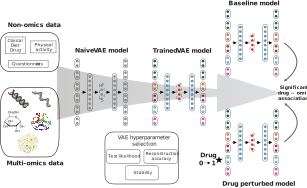

About the method
================

MOVE is based on the VAE (variational autoencoder) model, a deep learning model
that transforms high-dimensional data into a lower-dimensional space (so-called
latent representation). The autoencoder is made up of two neural networks: an
encoder, which compresses the input variables; and a decoder, which tries to
reconstruct the original input from the compressed representation. In doing so,
the model learns the structure and associations between the input variables.

In `our publication`_, we used this type of model to integrate different data
modalities, including: genomics, transcriptomics, proteomics, metabolomics,
microbiomes, medication data, diet questionnaires, and clinical measurements.
Once we obtained a trained model, we exploited the decoder network to identify
cross-omics associations.

Our approach consists of performing *in silico* perturbations of the original
data and using either univariate statistical methods or Bayesian decision
theory to identify significant differences between the reconstruction with or
without perturbation. Thus, we are able to detect associations between the
input variables.

.. _`our publication`: https://www.nature.com/articles/s41587-022-01520-x

VAE design
-----------

The VAE was designed to account for a variable number of fully-connected hidden
layers in both encoder and decoder. Each hidden layer is followed by batch
normalization, dropout, and a leaky rectified linear unit (leaky ReLU).

To integrate different modalities, each dataset is reshaped and concatenated
into an input matrix. Moreover, error calculation is done on a dataset
basis: binary cross-entropy for binary and categorical datasets and mean squared
error for continuous datasets. Each error :math:`E_i` is then multiplied by a
given weight :math:`W_i` and added up to form the loss function:

:math:`L = \sum_i W_i E_i + W_\textnormal{KL} D_\textnormal{KL}`

Note that the :math:`D_\textnormal{KL}` (Kullback–Leibler divergence) penalizes
deviance of the latent representation from the standard normal distribution. It
is also subject to a weight :math:`W_\textnormal{KL}`, which warms up as the
model is trained.

Extracting associations
-----------------------

After determining the right set of hyperparameters, associations are extracted
by perturbing the original input data and passing it through an ensemble of
trained models. The reason behind using an ensemble is that VAE models are
stochastic, so we need to ensure that the results we obtain are not a product
of chance.

We perturbed categorical data by changing its value from one category to
another (e.g., drug status changed from "not received" to "received"). Then, we
compare the change between the reconstruction generated from the original data
and the perturbed data. To achieve this, we proposed two approaches: using
*t*\ -test and Bayes factors. Both are described below:

MOVE *t*\ -test
^^^^^^^^^^^^^^^

#. Perturb a variable in one dataset.
#. Repeat 10 times for 4 different latent space sizes:

    #. Train VAE model with original data.
    #. Obtain reconstruction of original data (baseline reconstruction).
    #. Obtain 10 additional reconstructions of original data and calculate
       difference from the first (baseline difference).
    #. Obtain reconstruction of perturbed data (perturbed reconstruction) and
       subtract from baseline reconstruction (perturbed difference).
    #. Compute p-value between baseline and perturbed differences with t-test.

#. Correct p-values using Bonferroni method.
#. Select features that are significant (p-value lower than 0.05).
#. Select significant features that overlap in at least half of the refits and
   3 out of 4 architectures. These    features are associated with the
   perturbed variable.

MOVE Bayes
^^^^^^^^^^

#. Perturb a variable in one dataset.
#. Repeat 30 times:

    #. Train VAE model with original data.
    #. Obtain reconstruction of original data (baseline reconstruction).
    #. Obtain reconstruction of perturbed data (perturbed reconstruction).
    #. Record difference between baseline and perturbed reconstruction.

#. Compute probability of difference being greater than 0.
#. Compute Bayes factor from probability: :math:`K = \log p - \log (1 - p)`.
#. Sort probabilities by Bayes factor, from highest to lowest.
#. Compute false discovery rate (FDR) as cumulative evidence.
#. Select features whose FDR is above desired threshold (e.g., 0.05). These
   features are associated with the perturbed variable.